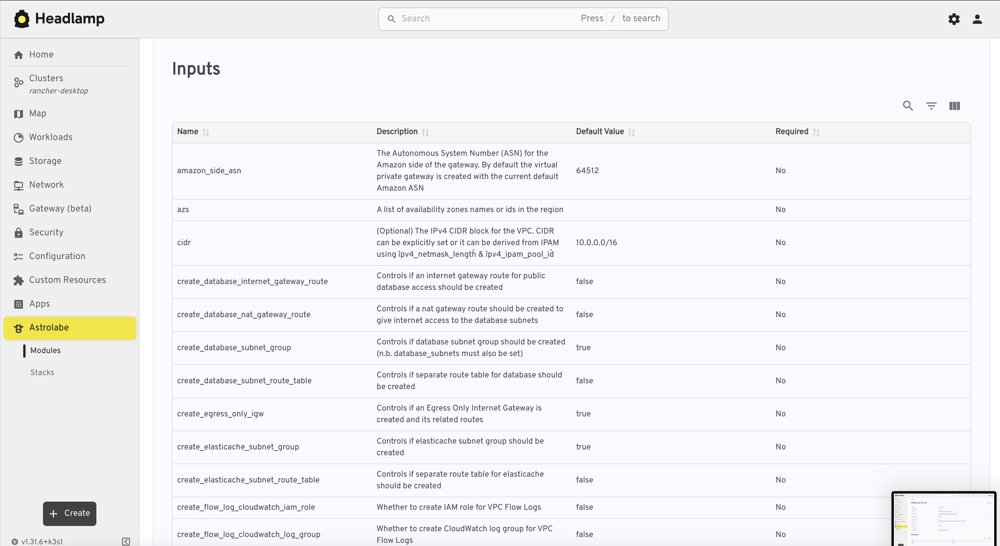

# Astrolabe
Astrolabe is a Kubernetes-native platform for managing and orchestrating Terraform/OpenTofu modules and infrastructure stacks using declarative custom resources.
Key features include module management, stack composition, backend and credentials abstraction, declarative automation, extensibility, and strong status/event reporting.
The technical architecture uses Kubernetes CRDs, a controller/operator, module parsing, and secure credential management.
Target users are platform, DevOps, SRE teams, and organizations adopting GitOps or Kubernetes-native automation.
The main goals are to enable IaC workflows, automate schema population/validation, empower modular and auditable automation, and separate backend/credential management for security and DRY principles.

# The custom resource Module.

Its main function is to:

Watch for changes to Module resources.
Compute a hash of the module's source (type, URL, version) and skip reconciliation if unchanged.
Fetch the module source (from git or HTTP archive), extract it, and run terraform-docs to parse its inputs, outputs, providers, etc.
Update the Module's status with parsed metadata and set various conditions (Ready, SourceHash, etc.).
Handle errors and update status accordingly.
Skip processing if the Module is being deleted.

In summary: it keeps the Module status in sync with the actual Terraform module source, parsing and updating metadata when the source changes.

# UI Screenshots

Below are screenshots of the Astrolabe UI demonstrating various features and views:

## Module List

## Module Details

### Module Details - Inputs

### Module Details - Outputs

### Module Details - Requirements

### Module Details - Resources

## Stack List

## Stack Details

